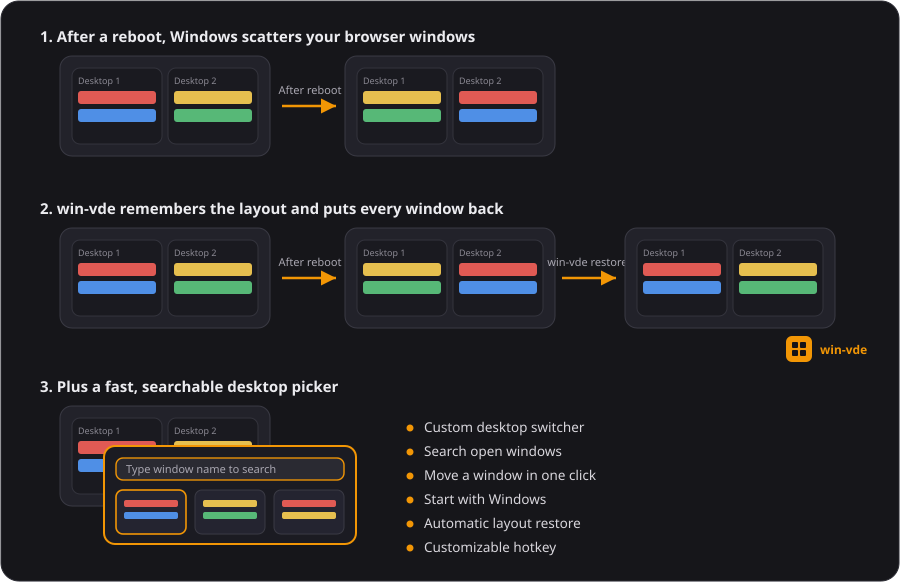

# win-vde — Virtual Desktop Extension for Windows 11

A small tray utility that remembers which **virtual desktop** each browser
window belongs to and puts them back automatically after a reboot or a browser
restart. It also adds a fast keyboard-driven picker for moving the active
window between desktops.

- **Author:** Volodymyr Moskvin — <info@conus.vision>
- **Repository:** https://github.com/conus-vision/win-vde
- **License:** MIT

**➡ [Download the latest `vde.exe`](https://github.com/conus-vision/win-vde/releases/latest)** — a single file, no installer. Or build it from source (see [Quick start](#quick-start)).

> Supports **Firefox, Chrome, and Edge** today. The picker has search, scrolling,
> and full-name tooltips.

<p align="center"></p>

## Quick start

1. **Get `vde.exe`.** Download it from the [Releases](https://github.com/conus-vision/win-vde/releases/latest) page, or build it with `build.bat` (see [Install / Build](#install--build)) — it lands at `build\vde.exe`. Either way it is a single, self-contained executable: no installer, no admin rights, no dependencies.
2. **Put it somewhere permanent.** Move `vde.exe` into a folder you intend to keep (for example `C:\Users\<you>\Apps\win-vde\`). Autostart remembers the exe's *current* path, so choose the folder **before** enabling it — if you move the exe later, just toggle autostart off and on again.
3. **Run it.** Double-click `vde.exe`; a tray icon appears next to the clock and it starts watching your browsers right away.
4. **Turn on autostart.** Right-click the tray icon → **Settings…** → tick **Start with Windows (run at logon)** → **OK**. Your layout will now be restored automatically after every reboot.

That's all — arrange your browser windows across your virtual desktops and forget about it. Press **Ctrl+Alt+D** whenever you want the desktop picker.

## Why this exists

Three things Windows and the browser don't solve on their own:

1. Windows 11 **doesn't remember** which virtual desktop a third-party app's
   window was on across a reboot — everything lands on desktop 1.
2. On session restore the browser recreates its windows, but their **window
   handles (HWND) and PIDs change**, so nothing external can recognize them by
   handle.
3. There is **no public Windows API** for moving another process's window
   between virtual desktops. It requires undocumented COM interfaces.

win-vde builds a stable *fingerprint* of each window from its content (the set
of tab domains + the active tab), matches old windows to new ones after a
restart, and moves each matched window to the desktop it was saved on.

## Features

- **Multi-browser** — Firefox (via its session store), Chrome and Edge (via
  their SNSS session files); each can be toggled in Settings. Windows are
  re-identified after a restart by their tab domains, falling back to the window
  title.
- **Automatic restore** — on utility start (if a browser is already open) and
  when a browser launches (after a ~20 s stabilization), windows are returned to
  their saved desktops.
- **30-day closed-window memory** — a closed Firefox, Chrome, or Edge window
  keeps its remembered virtual desktop for 30 days. If it reappears before
  expiry, VDE restores it before updating the saved layout.
- **Two layouts** — a rolling *auto* layout plus a manual checkpoint you save on
  demand.
- **Desktop picker** — global hotkey (default `Ctrl+Alt+D`) opens a grid of
  desktops. Click to switch; `Ctrl`+click to move the active window there. Type
  to filter windows — matching **any of their browser tabs**, not just the
  active one, by tab title *or* full **URL** (address bar) — scroll tiles with
  the wheel, hover a clipped name for its full title.
- **Persistent Ctrl+Click picker** — moving the active window also switches to
  the destination desktop while keeping the picker open and its active context
  highlighted.
- **Start with Windows** — optional run-at-logon toggle.
- **Honest about breakage** — if a Windows update changes the undocumented
  interfaces, the app explains what happened and runs in a limited mode instead
  of failing silently.

## Install / Build

Requires **Visual Studio 2022 or 2017** with the x64 build tools. From a normal
shell in the repo root:

```
build.bat
```

This compiles `src/vde.cpp` (+ `src/vde.rc`) into `build\vde.exe`. There are no
third-party dependencies. To run the unit tests for the pure logic:

```
build-test.bat
```

## Usage

Run `vde.exe` with no arguments to start the tray resident. Right-click the tray
icon for:

| Menu item | Action |
|---|---|
| **Open desktop picker** | Grid of desktops (also via the global hotkey) |
| **Save windows layout** | Save current windows to a manual checkpoint file |
| **Restore saved windows layout** | Restore from that manual checkpoint |
| **Restore last auto saved layout** | Restore from the rolling auto layout |
| **Settings…** | Hotkey, auto-save/restore, start-with-Windows |
| **About…** | Version, author, contact, project link |
| **Exit** | Quit after saving the current automatic layout |

**Picker:** click a desktop to switch to it; `Ctrl`+click to move the active
window there. Arrow keys / number keys navigate; `Esc` closes.

**Command line:**

```
vde.exe list          list virtual desktops
vde.exe status        desktops + live browser windows and their fingerprints
vde.exe save          save current layout to layout-manual.txt
vde.exe restore       restore from layout-manual.txt
vde.exe restore-auto  restore from the last auto-saved layout
```

## Data files

Stored under `%LOCALAPPDATA%\VirtualDesktopsExtention\`:

- `layout-auto.txt` — the rolling auto layout with 30-day closed-window
  retention.
- `layout-manual.txt` — your manual checkpoint (full snapshot).

A legacy `layout.txt` from earlier builds is migrated to `layout-auto.txt` on
first run.

## Autostart

Enable **Settings → Start with Windows (run at logon)** to have the utility
launch at sign-in (an `HKCU\…\Run` entry). This is what makes after-reboot
restore work unattended.

## Limitations & compatibility

- Moving other apps' windows between desktops uses **undocumented COM
  interfaces** whose identifiers can change between Windows 11 builds. If a
  build isn't recognized, win-vde shows a **compatibility notice** and runs in a
  limited (read-only) mode — it won't move windows blindly. Please report your
  Windows build to <info@conus.vision> so a fix can be published.
- Only the **virtual desktop** of each window is saved/restored — on-screen size
  and position are left to the browser's own session restore.
- Private Firefox windows aren't in the session store, so they're matched by
  title only.

## Roadmap

- Generic (user-defined) multi-window apps beyond the three built-in browsers.
- Optional restore of on-screen geometry (size/position), not just the desktop.

## License

MIT — see [LICENSE](LICENSE). © 2026 Volodymyr Moskvin (conus.vision).
