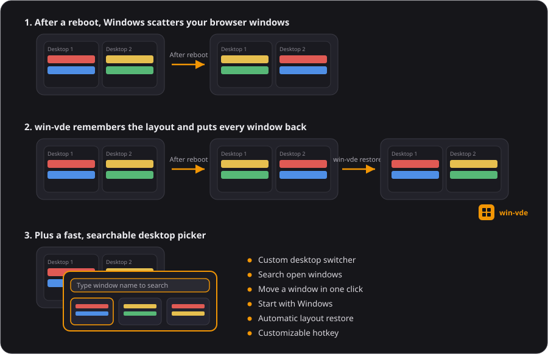

# win-vde: Virtual Desktop Extension for Windows 11

After a reboot, Windows 11 puts every browser window on desktop 1. win-vde
remembers which virtual desktop each Firefox, Chrome, and Edge window was on
and moves it back. It also remembers what each window held, so when the browser
loses a session you can reopen a desktop, a window, or a single tab right where
it used to be.

It is a small tray utility with three jobs:

1. It keeps your desktop layout. After a reboot, a browser restart, or a
   browser crash it puts each browser window back on its desktop. It acts only
   then: a window you open yourself stays where you opened it.
2. It brings back lost browsing sessions. Five checkpoints, the last saved
   state plus the last four shutdowns, each with its date and time, let you
   reopen any desktop, window, or single tab in its original window on its
   original desktop. Whatever is already open gets skipped. If a browser
   update, a crash, an accidental "close all windows", or a profile reset took
   your session, pick what you need and it comes back at about a second per
   window.
3. It gives you a fast desktop picker. A hotkey opens a searchable grid of all
   your desktops and their windows. From there you can switch desktops,
   activate an exact window, or drag a window row onto another desktop.

- Author: Volodymyr Moskvin, <info@conus.vision>
- Repository: https://github.com/conus-vision/win-vde
- License: MIT

**[Download the latest `vde.exe`](https://github.com/conus-vision/win-vde/releases/latest).**
It is a single file and needs no installer. You can also build it yourself, see
[Building from source](#building-from-source).

> Layout memory and session checkpoints work with Firefox, Chrome, and Edge.
> The picker also lists ordinary windows of other applications, with their
> icons, the active window highlighted, search, scrolling, and tooltips that
> show long names in full.

## Who it is for

- Anyone with more than a handful of browser windows: a research desktop, a
  work desktop, a shopping desktop. After a reboot Windows dumps them all on
  desktop 1, and win-vde puts each one back where it lived.
- Anyone who has lost a browser session. The browser updated and forgot it, a
  crash swallowed the windows, "Restore previous session" restored the wrong
  thing, or one careless click closed forty tabs. win-vde keeps its own
  checkpoints outside the browser, so you can restore exactly the desktop,
  window, or tab you miss.
- Anyone who wants to rebuild a working context on demand: bring the three
  windows of last Tuesday's project back onto their desktop without touching
  what is open now.

<p align="center"></p>

## Quick start

1. Download `vde.exe` from the
   [Releases](https://github.com/conus-vision/win-vde/releases/latest) page, or
   run `build.bat` (see [Building from source](#building-from-source)), which
   writes `build\vde.exe`. Either way you get one self-contained executable,
   and you don't need an installer, admin rights, or anything else.
2. Move `vde.exe` into a folder you plan to keep, for example
   `C:\Users\<you>\Apps\win-vde\`. Autostart stores the path the exe has when
   you turn it on, so choose the folder first. If you move the exe later, turn
   autostart off and on again.
3. Double-click `vde.exe`. A tray icon appears next to the clock, and win-vde
   starts watching your browsers right away.
4. Right-click the tray icon, choose **Settings...**, tick **Start with Windows
   (run at logon)**, and click **OK**. From then on your layout comes back by
   itself after every reboot.

That is the whole setup. Arrange your browser windows across your virtual
desktops and stop thinking about it. Press **Ctrl+Alt+D** whenever you want the
desktop picker.

## Why this exists

Three things Windows and the browser don't solve on their own:

1. Windows 11 doesn't remember which virtual desktop a third-party app's window
   was on across a reboot. Everything lands on desktop 1.
2. When a browser restores its session, it recreates its windows, and their
   window handles (HWND) and process IDs change. Nothing outside the browser
   can recognize them by handle.
3. Windows has no public API for moving another process's window between
   virtual desktops. It needs undocumented COM interfaces.

win-vde works around this by looking at what a window contains. It remembers
the pages each window holds, matches the old windows to the new ones after a
restart, and moves each window to the desktop it was saved on. While a window
stays open, win-vde doesn't need its pages at all: it identifies the window
exactly by its handle, process ID, and process start time. It keeps those
identities on disk, so a restart of win-vde itself is never mistaken for a
browser restart and moves nothing.

## Features

### Session checkpoints

win-vde keeps five checkpoints of your browser sessions and shows each with its
date and time. One holds the current state; win-vde refreshes it every few
minutes and each time you use **Save windows layout**. The other four hold the
last four shutdowns.

**Reopen browser windows...** lets you pick exactly what comes back. The dialog
has three cascading columns (desktops, then browser windows, then browser
tabs), each with check boxes, a select-all box in the column header, a "Hide
open" switch, and a text filter. A browser filter sits on top. Checking a
desktop selects its windows and their tabs; uncheck whatever you don't want.
The filters and "Hide open" change what you see, not what is selected.

- Tabs that are open in the browser right now are greyed out and start
  unchecked, and so are windows and desktops that are fully open. You can still
  check such a tab yourself. If win-vde can't read a browser's open tabs, that
  browser's windows start unchecked and the status line says so.
- The selected tabs return grouped into their original windows, each window on
  its original desktop. If a desktop no longer exists, the dialog marks it and
  its windows go to desktop 1.
- Reopening takes about a second per window. A progress bar shows how far it
  got, and **Cancel** stops it.
- The dialog resizes and maximizes, and its lists are virtual, so a checkpoint
  with hundreds of tabs stays responsive.

### Layout memory

win-vde reads Firefox windows from Firefox's session store and Chrome and Edge
windows from their SNSS session files. You can turn each browser on or off in
Settings.

After a restart, win-vde recognizes a window by its pages. It first looks for
an exact match of the whole set of tab URLs, then for matching tab domains, then
for the window title. Windows that hold exactly the same pages count as
interchangeable, and among equally good placements win-vde picks the one that
moves the fewest windows.

Windows move only when their identity is gone: after a reboot, a browser
restart, or a browser crash. Even then win-vde first waits about 20 seconds for
the windows to settle. When win-vde itself restarts, it moves nothing: it
recognizes the windows that survived by handle, process ID, and process start
time and adopts them again. A window you open while the browser is already
running is never relocated; win-vde records it where you opened it.

A closed Firefox, Chrome, or Edge window keeps its remembered virtual desktop
for exactly 30 days. If it reappears before then, win-vde puts it back on that
desktop before it updates the saved layout. At the 30-day mark the record
expires.

There are two layouts: a rolling automatic one, and a manual checkpoint that
you save when you choose.

### Desktop picker

The global hotkey, Ctrl+Alt+D by default, opens a grid of your desktops on the
primary monitor. You can pick another hotkey in Settings as long as it includes
Ctrl or Alt. The picker lists ordinary application windows as well as the
tracked browsers. Each row shows the application icon, and the exact active window is
highlighted. Hovering a row highlights its whole clickable area, icon included,
while the active-window highlight stays stronger. A tooltip shows any name that
is cut off.

- Click a window row to switch to the desktop it is shown on, close the picker,
  and activate that exact window. Click a desktop title or an empty part of a
  tile to switch desktops without activating any listed window.
- Hold Ctrl and click anywhere in a desktop tile, without dragging, to move the
  captured active window there. The picker switches to that desktop and stays
  open with the active window highlighted.
- Drag a window row to another desktop to move that exact window. The current
  desktop stays in place and the picker stays open.
  During the drag, a translucent copy with the application icon and window title follows the pointer.
  Drop it on another desktop to move or visually assign that window without switching desktops or closing the picker.
- When you move a Firefox, Chrome, or Edge window and the move is verified,
  win-vde updates its saved desktop. If that update cannot be saved, the
  window goes back, so automatic restore does not undo the move later. With
  automatic restore turned off, a browser window simply moves and nothing is
  saved. Moving another application's window changes only the live window and
  creates no restore record.
- Windows shown on every desktop, individually pinned windows, and
  application-wide pins are never physically moved. Instead, the picker shows
  the selected row under the destination tile until the popup closes, then
  builds the next popup from the actual Windows state. Pin state and saved
  layouts stay as they were.
- Type to filter rows by window title. A browser window also matches on any of
  its tabs, including inactive ones, by tab title or by full URL. The mouse
  wheel scrolls each desktop tile on its own.
- Keyboard: the arrow keys and Tab move the selection, Enter or Space switches
  to the selected desktop, and the keys 1 to 9 and 0 pick desktops 1 to 10.
  Hold Ctrl with Enter, Space, or a number to move the active window there
  instead. Esc closes the picker.

The picker footer links to
[Virtual Desktop Extension](https://github.com/conus-vision/win-vde) and
[Conus Vision](https://conus.vision).

## Building from source

You need Visual Studio 2017 or later with the C++ x64 build tools. Any edition
works, including Build Tools. Open a command prompt in the repository folder
and run:

```
build.bat
```

The script finds Visual Studio through `vswhere`; if you already have an x64
Native Tools Command Prompt open, it uses that. It compiles the sources in
`src\` together with the icon and manifest from `src\vde.rc` into
`build\vde.exe`. There are no third-party dependencies. `build-dev.bat` builds
the same program as `build\vde-dev.exe`.

To build and run the unit tests:

```
build-test.bat
```

## Usage

Run `vde.exe` with no arguments to start it in the tray. Right-click the tray
icon for the menu:

| Menu item | What it does |
|---|---|
| Open desktop picker | Opens the grid of desktops (the global hotkey does the same) |
| Save windows layout | Saves the current windows to the manual checkpoint file |
| Restore saved windows layout | Puts windows back from that manual checkpoint |
| Restore last auto saved layout | Puts windows back from the rolling automatic layout |
| Reopen browser windows... | Lets you pick desktops, windows, and tabs from a checkpoint and brings them back |
| Settings... | Hotkey, automatic save and restore, start with Windows, and which browsers to track |
| Help... | A short guide inside the app, with the contact and project links |
| About... | Version, author, contact, and project link |
| Exit | Saves the current automatic layout and quits |

### Command line

```
vde.exe list          list virtual desktops
vde.exe status        desktops + live browser windows and their fingerprints
vde.exe save          save current layout to layout-manual.txt
vde.exe restore       restore from layout-manual.txt
vde.exe restore-auto  restore from the last auto-saved layout
vde.exe checkpoints   list the saved browser-session checkpoints
```

`vde.exe --help` prints the same list.

### Picker diagnostics

If you are asked for a picker trace, first exit the running tray instance, then
start:

```text
build\vde.exe --trace-picker
```

Open the picker once, do one Ctrl+click, then exit VDE from the tray. The trace
is a size-limited JSONL file in
`%LOCALAPPDATA%\VirtualDesktopsExtention\diagnostics`. Ordinary launches never
trace, and autostart never adds the switch. The trace records no window titles,
searches, URLs, browser-session data, layout records, or full paths of other
applications.

## Data files

win-vde keeps its files in `%LOCALAPPDATA%\VirtualDesktopsExtention\`:

- `layout-auto.txt`: the rolling automatic layout, including closed windows
  for 30 days.
- `layout-manual.txt`: your manual checkpoint, a full snapshot.
- `sessions\session-saved.txt`: the last saved browser session, meaning the
  windows, their desktops, and the URL and title of every tab.
- `sessions\session-exit-1..4.txt`: the same for the last four shutdowns,
  newest first.
- `bindings.txt`: which live window (handle, process ID, process start time)
  currently owns which layout record. This file is how win-vde tells a browser
  restart from its own restart. If it is stale or missing, the only cost is one
  extra restore pass.

On first run, win-vde migrates a `layout.txt` from earlier builds to
`layout-auto.txt`, and it upgrades older v2, v3, and v4 layouts to v5 on its
own. The data folder and the registry key keep the historical spelling
"Extention" so that existing installs keep working.

## Autostart

Turn on **Settings > Start with Windows (run at logon)** and win-vde starts
when you sign in. It adds a value to
`HKCU\Software\Microsoft\Windows\CurrentVersion\Run`. Autostart is what lets
the layout come back after a reboot without you doing anything.

## Limitations and compatibility

- Moving other apps' windows between desktops relies on undocumented COM
  interfaces whose identifiers can change between Windows 11 builds. If win-vde
  doesn't recognize your build, it explains what happened and runs in a limited,
  read-only mode rather than moving windows blindly or failing silently. Please
  send your Windows build number to <info@conus.vision> so a fix can be
  published.
- win-vde saves and restores only the virtual desktop of each window. Size and
  position on screen are left to the browser's own session restore.
- Persistent window memory, automatic or manual, covers only Firefox, Chrome,
  and Edge. The picker can show, activate, and move windows of other
  applications, but it creates no restore records for them.
- If a saved virtual desktop has been deleted, the window goes to the desktop
  that now sits at that position, so it doesn't stay stranded.
- If the Windows shell (`explorer.exe`) restarts, win-vde puts its tray icon
  back and reconnects to the virtual-desktop services on its own, so moves
  keep working.
- win-vde recognizes dragging a tab out of a window, or merging two windows,
  for what it is. The layout follows the windows instead of sending one half to
  the desktop where the original window was remembered.
- If a browser runs as administrator, win-vde tells you once instead of
  reporting a generic failure: a program that isn't elevated can't move an
  elevated window.
- Private Firefox windows aren't in the session store, so win-vde matches them
  by title only, and they are not part of any session checkpoint.
- Reopening only adds windows. It never closes or rearranges the ones that are
  open. It skips tabs that are already open unless you check them yourself.
  It brings back the tab URLs, their order, and the window's desktop, but not
  tab history, pinned tabs, tab groups, form data, or scroll position.
- Reopening is sequential on purpose, at about a second per window: win-vde
  recognizes a new window as the difference in the browser's window set, and
  Firefox sends extra tabs to its most recent window.
- Edge keeps its session file locked while it runs, so until Edge closes,
  win-vde tracks Edge windows by title only.
- win-vde reads every browser profile that is currently open, not just the
  default one. It detects an open profile by the lock the browser holds on it.
  A profile that is merely installed is ignored, so its old windows can't
  confuse the matching.

## Roadmap

- Persistent restore profiles for other multi-window apps that you define,
  beyond the three built-in browsers.
- Optional restore of window size and position, not just the desktop.
- Telling a browser's PWA and app windows apart from ordinary browsing windows.
  Windows exposes no signal for this today.

## License

MIT, see [LICENSE](LICENSE). © 2026 Volodymyr Moskvin (conus.vision).
